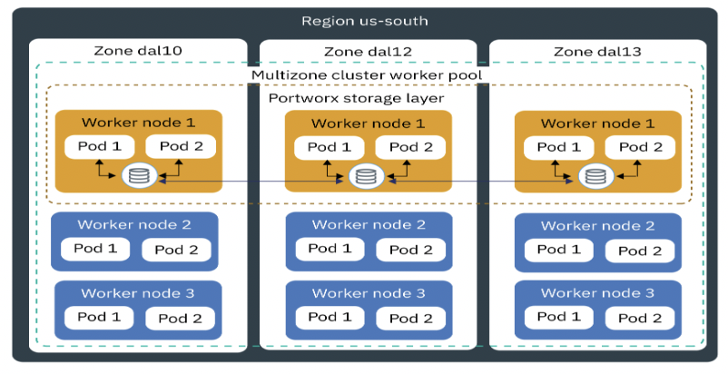
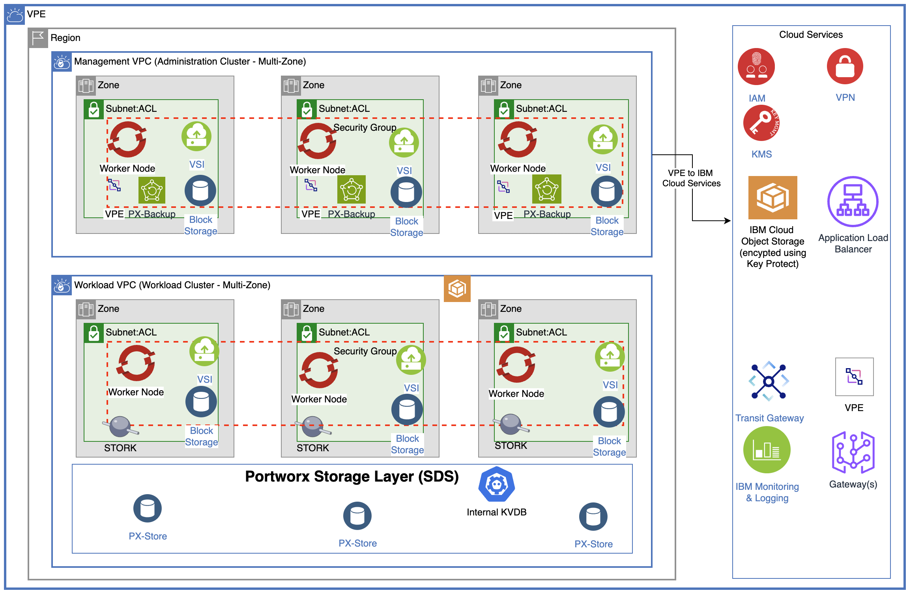

---

copyright:
  years: 2024
lastupdated: "2024-07-24"

subcollection: pattern-openshift-vpc-mz-resiliency

keywords:

authors:
- name: Joe Kiernan

# The release that the reference architecture describes
version: 1.0

# Use if the reference architecture has deployable code.
# Value is the URL to land the user in the IBM Cloud catalog details page for the deployable architecture.
# See https://test.cloud.ibm.com/docs/get-coding?topic=get-coding-deploy-button
deployment-url:

docs: /docs/pattern-openshift-vpc-mz-resiliency

content-type: reference-architecture

---

{{site.data.keyword.attribute-definition-list}}

# OpenShift on VPC 
{: #openshift-on-vpc}
{: toc-content-type="reference-architecture"}
{: toc-version="1.0"}

# 4. Solution Architecture

-   ROKS is deployed on VPC Servers across three availability zones within a region.
-   Compatible/recommended nodes (that are currently available for ROKS on IBM Cloud – Virtual Servers Instances Shared) are used for worker nodes to run stateful application in production environment.   
    Ref: IBM Cloud Docs
-   High performance Secondary storage (10 IOPS Block) is used and attached to worker nodes. Portworx Enterprise (an SDS – Software Defined Storage) is setup in the cluster across three zones using a Converged architecture (compute and storage in same node). Built-in internal key-value database (KVDB) is used for Portworx cluster.
-   Ref: Portworx Docs
-   Any databases that may be required for the stateful applications use the Portworx SDS.
-   In the ROKS multizone cluster, the worker nodes in the worker pools are distributed across multiple zones within one region. ROKS multizone clusters are designed to *evenly* schedule pods across worker nodes and zones to ensure availability and recovery from failure. If worker nodes are not spread *evenly* across the zones or capacity is insufficient in one of the zones, the ROKS controller might fail to schedule all requested pods.
-   Application Load Balancer (ALB) for VPC with multi-zone support is used to route traffic to the containerized application.
-   Containerized stateful applications are deployed within the Workload cluster and VPC. Management tools, such as backup tools, are deployed in the Management cluster and VPC. A local Transit Gateway allows traffic between the management and workload VPCs.
-   Worker nodes in worker pools are placed in separate subnets within each availability zone.
-   Security groups and ACLs (Access Control Lists) are used as firewalls to limit access to worker node server for operational purposes and control network traffic.
-   All storage is encrypted at rest using storage encryption with customer-provided keys managed by Key Protect.
-   Data is encrypted in transit using TLS encryption. Portworx Backup is used to enable backup and recovery of containerized applications deployed in the workload cluster. The Portworx Backup source is the PX-Store (SDS) configured for the workload cluster. The Portwork Backup target is IBM Cloud Object Storage (COS). Portworx Backup supports encryption of backups in transit. IBM COS supports encryption with Key Management Services. Portworx Backup is setup in management VPC in a management or administration cluster also spread across three availability zones.
-   The OpenShift Container Platform monitoring stack is based on the Prometheus, which also can be used to monitor the Portworx cluster
-   Built-in Red Hat OpenShift logging tools are used for Portworx logging.

## Architecture diagram 
{: #architecture-diagram}

## 4.1 Solution Architecture Diagram

[Multi-Zone Resiliency for ROKS Solution Architecture]

## 4.2 Solution Components

| Category              | Solution Components                                                                                                                   | How it is used in solution                                                                                                            |
|-----------------------|---------------------------------------------------------------------------------------------------------------------------------------|---------------------------------------------------------------------------------------------------------------------------------------|
| Compute               | Red Hat OpenShift Cluster                                                                                                             | Kubernetes cluster for containerized applications and backup tools                                                                    |
| Storage               | VPC Block Storage                                                                                                                     | For Worker nodes storage & Portworx SDS                                                                                               |
|                       | Portworx Enterprise                                                                                                                   | Portworx Enterprise provides highly available unified storage across multiple zones for stateful applications                         |
|                       | [Cloud Object Storage](https://cloud.ibm.com/docs/cloud-object-storage?topic=cloud-object-storage-about-cloud-object-storage) (COS)   | backups, logs (application, operational and audit logs)                                                                               |
|                       | Portworx Internal KVDB                                                                                                                | To store the cluster's state, configuration data, and metadata associated with storage volumes and snapshots.                         |
| Networking            | [VPC Virtual Private Network (VPN) Client](https://cloud.ibm.com/docs/iaas-vpn?topic=iaas-vpn-getting-started)                        | Remote access to manage resources in private network                                                                                  |
|                       | [Virtual Private Clouds (VPCs), Subnets, Security Groups (SGs), ACLs](https://cloud.ibm.com/docs/vpc?topic=vpc-getting-started)       | VPCs for workload isolation Subnets, SGs, and ACLs for restricted access to stateful application components                           |
|                       | [Local Transit Gateway (TGW)](https://cloud.ibm.com/docs/transit-gateway?topic=transit-gateway-getting-started)                       | Connectivity between Workload and Management VPCs                                                                                     |
|                       | [Virtual Private Gateway & Virtual Private Endpoint (VPE)](https://cloud.ibm.com/docs/vpc?topic=vpc-about-vpe)                        | Private network access to Cloud Services, e.g. Key Protect, COS, etc.                                                                 |
|                       | [VPC Application Load Balancer](https://cloud.ibm.com/docs/vpc?topic=vpc-load-balancers)                                              | Application Load Balancing for containerized apps                                                                                     |
|                       |                                                                                                                                       |                                                                                                                                       |
|                       | [Cloud Internet Services (CIS)](https://cloud.ibm.com/docs/cis?topic=cis-getting-started)                                             | Public DNS resolution                                                                                                                 |
|                       | [DNS Services](https://cloud.ibm.com/docs/dns-svcs?topic=dns-svcs-about-dns-services)                                                 | Private DNS resolution                                                                                                                |
| Security              | [IAM](https://cloud.ibm.com/docs/account?topic=account-cloudaccess)                                                                   | IBM Cloud Identity & Access Management                                                                                                |
|                       | [Cloud Internet Services (CIS)](https://cloud.ibm.com/docs/cis?topic=cis-getting-started)                                             | DDoS protection and Web App Firewall                                                                                                  |
|                       | [Key Protect](https://cloud.ibm.com/docs/key-protect?topic=key-protect-about)                                                         | Key Management Service                                                                                                                |
|                       | [Secrets Manager](https://cloud.ibm.com/catalog/services/secrets-manager)                                                             | Certificate and Secrets Management                                                                                                    |
|                       |                                                                                                                                       |                                                                                                                                       |
| Service Management    | OpenShift Logging & Monitoring Tools                                                                                                  | For ROKS cluster and app logs and cluster metrics and app monitoring & Portworx Enterprise and Portworx Backup logging and monitoring |
| Resiliency & Capacity | [Cross-Region COS Buckets](https://cloud.ibm.com/docs/cloud-object-storage/basics?topic=cloud-object-storage-endpoints#endpoints-geo) | Backup storage (target for PX-Backup)                                                                                                 |
|                       | Cluster Autoscaler                                                                                                                    | To adjust compute and storage capacity based on load changes                                                                          |
|                       | VPC VSI (worker nodes) evenly spread across three zones, Portworx Enterprise (SDS) across multiple zones in a region                  | For Stateful Containerized apps high availability deployment                                                                          |
|                       | Portworx Backup (PX-Backup)                                                                                                           | For Backup and Restore of stateful applications data                                                                                  |

## Design scope 
{: #design-scope}

Following the [Architecture Framework](/docs/architecture-framework?topic=architecture-framework-taxonomy), pattern-name covers design considerations and architecture decisions for the following aspects and domains:

- **Compute:** Bare Metal and Virtual infrastructure

- **Storage:** Primary, Backup, Archive and Migration

- **Networking:** Enterprise Connectivity, Edge Gateways, Segmentation and Isolation, Cloud Native Connectivity and Load Balancing

- **Security:** Data, Identity and Access Management, Infrastructure and Endpoint, Threat Detection and Response

- **Resiliency:** Backup and Restore, Disaster Recovery, High Availability

- **Service Management:** Monitoring, Logging, Alerting, Management/Orchestration

The Architecture Framework, described in [Introduction to the Architecture Framework](/docs/architecture-framework?topic=architecture-framework-intro), provides a consistent approach to design cloud solutions by addressing requirements across a pre-defined set of aspects and domains, which are technology-agnostic architectural areas that need to be considered for any enterprise solution. It can be used as a guide to make the necessary design and component choices to ensure you have considered applicable requirements for each aspect and domain. After you have identified the applicable requirements and domains that are in scope, you can evaluate and select the best fit for purpose components for your enterprise cloud solution.

The Figure 3 shows the domains that are covered in this solution.

Figure 3 design scope

## Requirements 
{: #requirements}

The following represents a baseline set of requirements which we believe are applicable to most clients and critical to successful SAP deployment.

| Aspect | Requirement |
|---------------------------------|----------------------------------------------------------------------------------------------------------------------------------------------------------------------------------------------------------------------------------------|
| Network| Enterprise connectivity to customer data center(s) to provide access to applications from on-prem|
| | Map and convert existing customer SAP Network functionality into IBM Cloud and VPC networking services|
| | Migrate/Redeploy customer IP addressing scheme within the IBM Cloud environment |
| | Provide network isolation with the ability to segregate applications based on attributes such as data classification, public vs internal apps and function  |
| Security | Provide data encryption in transit and at rest|
| | Migrate customer IDS/IAM Services to target IBM Cloud environment |
| | Retain the same firewall rulesets across existing DCs |
| | Firewalls must be restrictively configured to provide advanced security features and prevent all traffic, both inbound and outbound, except that which is specifically required, documented, and approved, and include IPS/IDS services |
| Resiliency | Multi-site capability to support a disaster recovery strategy and solution leveraging IBM Cloud infrastructure DR capabilities|
| | Provide backups for data retention|
| | RTO/RPO = 4 hours/15 minutes; Rollback to original environments should occur no later than specified RTOs |
| | 99.95 Availability|
| | Backups |
| | Prod: Daily Full, logs per SAP product standard, 30 days retention time \n Non-Prod: Weekly full, logs per SAP product standard, 14 days retention time|
| Service management | Provide Health and System Monitoring with ability to monitor and correlate performance metrics and events and provide alerting across applications and infrastructure |
| | Ability to diagnose issues and exceptions and identify error sources|
| | Automate management processes to keep applications and infrastructure secure, up to date, and available |
| Other| Migrate SAP workloads from existing data center to IBM Cloud VPC |
| | Customer's SAP systems and applications run on NetWeaver (application) & HANA (DB), AnyDB or S/4 HANA |
| | Provide an Image Replication migration solution that will minimize disruption during cut-over|
| | Cloud infrastructure for the proposed IAAS solution must be SAP Certified |
| | IBM Cloud IaaS will be deployed to support SAP and surrounding non-SAP workloads |
| | Customer does not want to adopt [RISE](https://www.ibm.com/consulting/rise-with-sap?utm_content=SRCWW&p1=Search&p4=43700077624079785&p5=e&gclid=EAIaIQobChMIr9bRlt7LgQMVJdHCBB0cewwcEAAYASAAEgIVgfD_BwE&gclsrc=aw.ds) at this time but wants to consider Cloud deployment solution that would facilitate a future RISE transformation|
 {: caption="Table 1. Pattern requirements" caption-side="bottom"}
 
## Components 
{: #components}

| Aspect| Component| How the component is used|
|-------------------|--------------------------------------------------------------------------------------------------------------------------------------------|-------------------------------------------------------------------------------------------------------------------|
| Compute|[VPC VSIs](docs/vpc?topic=vpc-vsi_best_practices&interface=ui)|NetWeaver and HANA DB|
|Storage|[VPC Block Storage](/docs/openshift?topic=openshift-vpc-block)|NetWeaver and HANA DB servers primary storage. Backup storage|
| |[Cloud Object Storage](/docs/cloud-object-storage?topic=cloud-object-storage-about-cloud-object-storage)|Backup and archive, application logs, operational logs and audit logs
|Networking|[VPC Virtual Private Network (VPN)](/docs/iaas-vpn?topic=iaas-vpn-getting-started)|Remote access to manage resources in private network|
| |[Virtual Private Gateway & Virtual Private Endpoint (VPE)](/docs/vpc?topic=vpc-about-vpe)| For private network access to Cloud Services, e.g. Key Protect, COS, etc.|
| | [VPC Load Balancers](/docs/vpc?topic=vpc-load-balancers) | Application Load Balancing for web servers, app servers, and database servers|
| | Public gateway| For web server access to the internet|
| | [Cloud Internet Services (CIS)](/docs/cis?topic=cis-getting-started) | Public Load balancing and DDoS of web servers traffic across zones in the region|
| | [DNS Services](/docs/dns-svcs?topic=dns-svcs-about-dns-services) | |
| | [VPCs and subnets](/docs/vpc?topic=vpc-about-subnets-vpc&interface=ui) | Network Segmentation/Isolation |
| | [Transit Gateway](/docs/transit-gateway?topic=transit-gateway-about) | Connect across multiple VPCs |
| | [IBM Cloud Application Load Balancer](/docs/vpc?topic=vpc-load-balancers-about) (ALB) \n SAP Web Dispatcher | Load balancing workloads across multiple workload instances over the private network |
|Security |[Block Storage encryption](/docs/vpc?topic=vpc-mng-data&interface=ui) with provider keys | Block Storage Encryption at rest |
| | Cloud Object Storage Encryption | Cloud Object Storage Encryption at rest|
| | HANA Data Volume Encryption (DVE) | HANA Database Encryption at rest |
| | [IAM](/docs/account?topic=account-cloudaccess) | IBM Cloud Identity & Access Management |
| | Privileged Identity and Access Management | BYO Bastion host (or Privileged Access Gateway) with PAM SW deployed in Edge VPC |
| | [BYO Bastion Host on VPC VSI with PAM SW](/docs/framework-financial-services?topic=framework-financial-services-vpc-architecture-connectivity-bastion-tutorial-teleport) | Remote access with Privileged Access Management|
| | [Virtual Private Clouds (VPCs), Subnets, Security Groups, ACLs](/docs/vpc?topic=vpc-getting-started) | Core Network Protection|
| | [Cloud Internet Services (CIS)](/docs/cis?topic=cis-getting-started) | DDoS protection and Web App Firewall |
| | One of the following: \n - [Fortigate](https://cloud.ibm.com/catalog/content/ibm-fortigate-AP-HA-terraform-deploy-5dd3e4ba-c94b-43ab-b416-c1c313479cec-global) \n - [Juniper vSRX](https://cloud.ibm.com/catalog/content/juniper-vsrx-catalog-deploy-1.4-dc1e707c-33dd-4321-b2a5-c22dbf0dd0ee-global) \n -[Palo Alto](https://cloud.ibm.com/catalog/content/ibmcloud-vmseries-1.9-6470816d-562d-4627-86a5-fe3ad4e94b30-global)| - IPS/IDS protection at all ingress/egress \n- Unified Threat Management (UTM) Firewall|
| Resiliency | HANA System Replication (HSR) | Provide 99.95% availability for HANA DB|
| | [Veeam](/docs/vpc?topic=vpc-about-veeam) | Controls both the backups and restores of all VSIs or BMs. Veeam Backup & Replication 12 |
| Service Management (Observability) | [IBM Cloud Monitoring](/docs/monitoring?topic=monitoring-about-monitor)| Apps and operational monitoring|
| | [IBM Log Analysis](/docs/log-analysis?topic=log-analysis-getting-started) | Apps and operational logs |
{: caption="Table 2. Pattern components" caption-side="bottom"} <!-- each table MUST have a caption attribute>

As mentioned earlier, the Architecture Framework is used to guide and determine the applicable aspects and domains for which architecture decisions need to be made. The following sections contain the considerations, and architecture decisions for the aspects and domains that are in play in this solution pattern.
