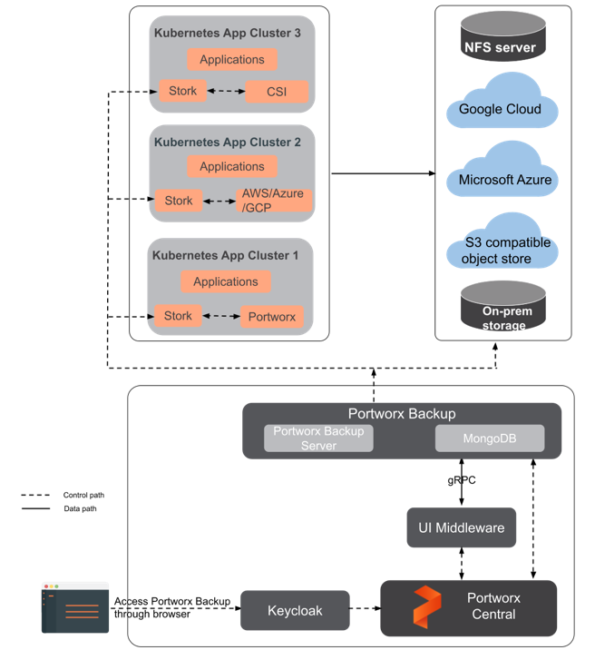

---

copyright:
  years: 2024
lastupdated: "2024-07-23"

subcollection: pattern-openshift-vpc-mz-resiliency

keywords:

---

{{site.data.keyword.attribute-definition-list}}

# Resiliency Design Considerations
{: #resiliency-design}

The resiliency of applications deployed on Red Hat OpenShift clusters is determined by the availability of the cluster as well as the availability of the application.

**Cluster availability**

The availability of Red Hat OpenShift clusters depends on the availability of the control plane components, namely, the master nodes and etcd database, and the availability of the worker nodes where the applications are deployed.

For workloads deployed on Red Hat OpenShift on IBM Cloud clusters, IBM Cloud is responsible for the availability of the cluster’s control plane. When a Red Hat OpenShift on IBM Cloud cluster is created, IBM Cloud sets up highly available master nodes and control plane components, automatically backs up etcd data, and provides automated disaster recovery for the control plane. IBM Cloud users are responsible for setting up highly available worker nodes. The following are deployment options for Red Hat OpenShift on IBM Cloud clusters:

**Single-zone clusters**

In single zone clusters, all the worker nodes are provisioned in one availability zone selected by the user. For high availability, at least 3 worker nodes are recommended so that application instances can be distributed across multiple worker nodes to provide protection from worker node failures. Red Hat OpenShift automatically reschedules pods from unavailable worker nodes. In single-zone clusters, IBM Cloud automatically creates three replicas of master components for high availability. If the cluster is created in a multizone region, the three master replicas are spread across the availability zones in the region.

Single-zone clusters provide protection from logical and container failures but do not protect from zone failures or physical host failures since there is no guarantee that the worker nodes will be placed in different physical hosts. Single-zone clusters provide cost-effective solutions with 99.9% infrastructure availability that might be appropriate for non-production environments or non-business critical applications.

**Multi-zone clusters**

In multi-zone clusters, the worker nodes are distributed across availability zones selected by the user. IBM Cloud automatically provisions three replicas of master components spread across availability zones within a region for high availability.

It is recommended to spread the worker nodes evenly across three zones, with 50% capacity provisioned in each zone for a total 150% capacity across all worker nodes. This is a cost-efficient solution that guarantees 100% capacity for the workloads in the event of one zone failure and provides 99.99% infrastructure availability. In contrast, spreading the nodes across two zones would require 100% capacity in each zone for a total capacity of 200% vs 150% and would offer only 99.9% infrastructure availability.

Multi-zone clusters, also known as stretched clusters, provide protection from zone failures and physical host failures. If resources in one zone go down, the workloads can continue to run in worker nodes in the other zones.

Multi-zone clusters are recommended for business-critical applications.

**Application availability**

The availability of a containerized application depends on the availability of the pods where the application is deployed and the application’s scalability and ability to handle workload changes. For stateful applications, persistent storage data availability and consistency are also important considerations.

You can use Kubernetes constructs such as deployments, replica sets, and pod anti-affinity to increase the application availability, as follows:

-   Use a [deployment](https://kubernetes.io/docs/concepts/workloads/controllers/deployment/) to support pod rescheduling, replica sets, and rolling updates.
-   Use [replica sets](https://cloud.ibm.com/docs/openshift?topic=openshift-app#replicaset) to define multiple instances of your application. Include enough replicas for your workload plus two.
-   Use [pod anti-affinity](https://cloud.ibm.com/docs/openshift?topic=openshift-app#affinity) options to spread the deployment of pods across different worker nodes to protect applications from worker nodes failures. Note that worker nodes in one zone are not guaranteed to be on separate physical compute hosts. To protect against physical compute hosts failure, you must set up a multi-zone cluster which will spread worker nodes across physical hosts in different zones.

Enable [horizontal pod autoscaling](https://cloud.ibm.com/docs/openshift?topic=openshift-update_app#app_scaling) to automatically increase or decrease the number of instances of the application based on metrics collected from the pods.

Use [cluster autoscaler](https://cloud.ibm.com/docs/openshift?topic=openshift-cluster-scaling-classic-vpc&interface=ui) to automatically increase or decrease the number of worker nodes based on workload demands.

For stateful applications, use highly available persistent storage based on the application requirements and deploy applications in a multizone cluster to distribute persistent storage data across multiple availability zones.

In multi-zone clusters, data replication across availability zones can be achieved through application-level replication or storage replication.

Portworx and OpenShift Data Foundation (ODF) are Software Defined Storage (SDS) solutions that support data replication and can be deployed on Red Hat OpenShift clusters on IBM Cloud to provide persistent storage for stateful apps. Portworx and ODF replicate data across worker nodes to ensure the stateful app can be rescheduled to a different worker node in case of failure without losing data.

## High Availability Design

The Multi-zone Resiliency pattern for ROKS deploys the Red Hat OpenShift cluster architecture across multiple availability zones within a region. The worker nodes are evenly spread across three availability zones. For multizone clusters, Portworx is recommended as SDS for stateful applications. Portworx is a highly available SDS solution that provides persistent storage for the containerized databases and stateful apps and enables sharing of data between pods across multiple zones. Portworx abstracts storage of various types and sizes attached to the worker nodes in the cluster. Worker nodes with attached storage are added as a node to a storage cluster and presented as a virtual storage pool for the stateful applications. The storage cluster is managed by PX-Store, a component of Portworx and it automatically replicates data in the volumes across worker nodes and zones in the cluster so stateful applications can be rescheduled to another worker node in case of a worker node failure or reboot providing high availability across nodes/racks/AZs. PX-Store supports multi-writer shared volumes across multiple containers.

Following are Portworx (High Availability) requirements for enterprise stateful applications:

-   Minimum 3 worker nodes across 3 AZs
-   Minimum of 8 cores & 8 GB RAM are recommended to be reserved for Portworx  
    [Note: These are minimum number of nodes/cores/memory. Depending on the scale of production environment, more nodes and higher cores/memory will be required.]

## Backup and Restore Design

Backup and restore solutions for containerized applications must protect both the cluster as well as the application to enable recovery in the event of failures triggered by ransomware attacks, software data corruption, accidental deletions, or any other cause.

Red Hat OpenShift on IBM Cloud clusters include automatic back-up and recovery of cluster control plane components, namely etcd data. The user is responsible for backing up the application. Application backups must protect application data and metadata included in application-related cluster resources, stateful application’s data stored in persistent storage, and internal images.

The Multi-zone Resiliency pattern for ROKS uses Portworx to backup the application.

Portworx Backup provides Kubernetes data protection platform for the persistent data both in transit and at rest. It is app-aware including stateful apps and provides a simple self-service interface for backup and restore. It can operate at Pod, Namespace or Cluster level. Portworx Backup (PX-Backup) is setup in Management VPC in an administration mutizone cluster. The following is Portworx Backup solution at a high level:

-   Backup Source: Portworx Enterprise (PX-Store) – SDS for stateful application
-   Target: IBM Cloud Object Storage (COS)
-   Portworx has Backup Automation and Scheduling
-   STORK (STorage Orchestrator Runtime for Kubernetes) provides Kubernetes consistent backup of applications (running in workload cluster) across multi-pod in a namespace. STORK is an agent and should be installed on the application cluster before PX-Backup cluster installation. STORK bridges the gap between Portworx Backup running on your management cluster, and the workload cluster that need to be backed up.
-   Portworx Backup uses MongoDB (runs with 3 replicas for high availability) as the datastore (installed as part of the Portworx Backup deployment) for writing the metadata of backup object data.

    
